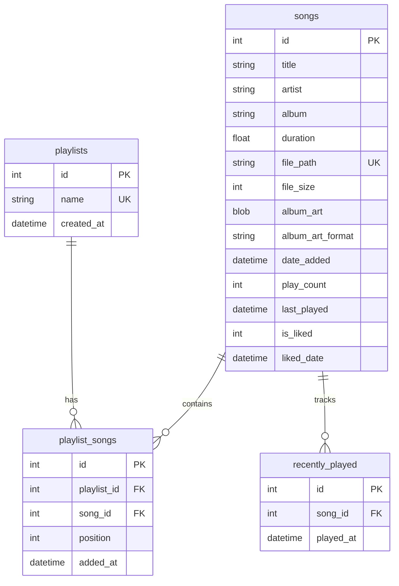

# Database Schema

Celes uses Better-SQLite3 for fast, synchronous database operations. The database is stored in the user data directory (`app.getPath('userData')/music.db`).

## Database Tables

### songs
Primary table storing music file metadata and user data.

```sql
CREATE TABLE songs (
  id INTEGER PRIMARY KEY AUTOINCREMENT,
  title TEXT NOT NULL,
  artist TEXT,
  album TEXT,
  duration REAL,                    -- Duration in seconds (floating point)
  file_path TEXT UNIQUE NOT NULL,   -- Absolute path to audio file
  file_size INTEGER,                -- File size in bytes
  album_art BLOB,                   -- Binary album art data
  album_art_format TEXT,            -- MIME type (e.g., 'image/jpeg')
  date_added DATETIME DEFAULT CURRENT_TIMESTAMP,
  play_count INTEGER DEFAULT 0,
  last_played DATETIME,
  is_liked INTEGER DEFAULT 0,       -- Boolean (0/1) for liked songs
  liked_date DATETIME               -- When song was liked
);
```

**Indexes:**
```sql
CREATE INDEX idx_songs_artist ON songs(artist);
CREATE INDEX idx_songs_album ON songs(album);
```

**Key Features:**
- `file_path` has UNIQUE constraint to prevent duplicates
- `album_art` stored as BLOB for embedded artwork
- `duration` is floating point for precise timing
- `play_count` and `last_played` track usage statistics
- `is_liked` and `liked_date` support user favorites

### playlists
Stores user-created playlists and system playlists.

```sql
CREATE TABLE playlists (
  id INTEGER PRIMARY KEY AUTOINCREMENT,
  name TEXT NOT NULL UNIQUE,
  created_at DATETIME DEFAULT CURRENT_TIMESTAMP
);
```

**System Playlists:**
- "All Songs" - Contains all imported music (created automatically)

**User Playlists:**
- Custom playlists created by user
- Names must be unique

### playlist_songs
Junction table implementing many-to-many relationship between playlists and songs.

```sql
CREATE TABLE playlist_songs (
  id INTEGER PRIMARY KEY AUTOINCREMENT,
  playlist_id INTEGER,
  song_id INTEGER,
  position INTEGER,                 -- Order within playlist
  added_at DATETIME DEFAULT CURRENT_TIMESTAMP,
  FOREIGN KEY (playlist_id) REFERENCES playlists (id) ON DELETE CASCADE,
  FOREIGN KEY (song_id) REFERENCES songs (id) ON DELETE CASCADE,
  UNIQUE(playlist_id, song_id)      -- Prevent duplicate entries
);
```

**Index:**
```sql
CREATE INDEX idx_playlist_songs_playlist ON playlist_songs(playlist_id);
```

**Key Features:**
- `position` maintains song order within playlists
- CASCADE DELETE ensures cleanup when playlists/songs are deleted
- UNIQUE constraint prevents duplicate songs in same playlist

### recently_played
Tracks song playback history for "Recently Played" smart playlist.

```sql
CREATE TABLE recently_played (
  id INTEGER PRIMARY KEY AUTOINCREMENT,
  song_id INTEGER,
  played_at DATETIME DEFAULT CURRENT_TIMESTAMP,
  FOREIGN KEY (song_id) REFERENCES songs (id) ON DELETE CASCADE
);
```

**Indexes:**
```sql
CREATE INDEX idx_recently_played_song ON recently_played(song_id);
CREATE INDEX idx_recently_played_date ON recently_played(played_at);
```

**Key Features:**
- Maintains chronological playback history
- Limited to 100 most recent entries (auto-cleanup)
- Enables "Recently Played" smart playlist generation

## Data Relationships



## Database Initialization

### Table Creation
Tables are created with `IF NOT EXISTS` to support upgrades:

```javascript
this.db.exec(`
  CREATE TABLE IF NOT EXISTS songs (
    -- schema definition
  );
  -- Additional tables...
`);
```

### Migration System
The database includes migration logic for schema updates:

```javascript
migrateDatabase() {
  const tableInfo = this.db.prepare("PRAGMA table_info(songs)").all();
  const hasIsLiked = tableInfo.some(column => column.name === 'is_liked');
  
  if (!hasIsLiked) {
    console.log('Adding is_liked column to songs table...');
    this.db.exec('ALTER TABLE songs ADD COLUMN is_liked INTEGER DEFAULT 0');
  }
}
```

### Default Data
"All Songs" playlist is created automatically:

```javascript
const allSongsPlaylist = this.db.prepare('SELECT id FROM playlists WHERE name = ?').get('All Songs');
if (!allSongsPlaylist) {
  this.db.prepare('INSERT INTO playlists (name) VALUES (?)').run('All Songs');
}
```

## Query Patterns

### Song Retrieval
```sql
-- All songs with metadata
SELECT * FROM songs ORDER BY artist, album, title;

-- Liked songs only
SELECT * FROM songs WHERE is_liked = 1 ORDER BY liked_date DESC;

-- Recently added
SELECT * FROM songs ORDER BY date_added DESC LIMIT 50;

-- Most played
SELECT * FROM songs WHERE play_count > 0 ORDER BY play_count DESC, last_played DESC LIMIT 50;
```

### Playlist Operations
```sql
-- Get playlist with songs
SELECT s.*, ps.position 
FROM songs s
JOIN playlist_songs ps ON s.id = ps.song_id
WHERE ps.playlist_id = ?
ORDER BY ps.position;

-- Add song to playlist (with position)
INSERT INTO playlist_songs (playlist_id, song_id, position) 
VALUES (?, ?, (SELECT COALESCE(MAX(position), 0) + 1 FROM playlist_songs WHERE playlist_id = ?));
```

### Recently Played Management
```sql
-- Add to recently played
INSERT INTO recently_played (song_id) VALUES (?);

-- Cleanup old entries (keep last 100)
DELETE FROM recently_played 
WHERE id NOT IN (
  SELECT id FROM recently_played 
  ORDER BY played_at DESC 
  LIMIT 100
);
```

## Performance Considerations

### Synchronous Operations
Better-SQLite3 uses synchronous operations, eliminating async overhead:

```javascript
// No async/await needed
const songs = this.db.prepare('SELECT * FROM songs').all();
```

### Prepared Statements
All queries use prepared statements for performance and security:

```javascript
const insertSong = this.db.prepare(`
  INSERT INTO songs (title, artist, album, duration, file_path, file_size)
  VALUES (?, ?, ?, ?, ?, ?)
`);

// Reuse prepared statement
const result = insertSong.run(title, artist, album, duration, filePath, fileSize);
```

### Indexing Strategy
Indexes are created on frequently queried columns:
- `artist` and `album` for browsing
- `playlist_id` for playlist queries
- `song_id` and `played_at` for recently played

### Album Art Storage
Album art is stored as BLOB in database rather than separate files:
- Eliminates file system dependencies
- Ensures consistency with song metadata
- Reduces I/O operations
- Automatic cleanup when songs are deleted

## Data Integrity

### Foreign Key Constraints
```sql
FOREIGN KEY (song_id) REFERENCES songs (id) ON DELETE CASCADE
```
Ensures referential integrity and automatic cleanup.

### Unique Constraints
```sql
file_path TEXT UNIQUE NOT NULL  -- Prevents duplicate imports
name TEXT NOT NULL UNIQUE       -- Prevents duplicate playlist names
UNIQUE(playlist_id, song_id)    -- Prevents duplicate playlist entries
```

### Transaction Safety
All multi-operation sequences use transactions:

```javascript
const transaction = this.db.transaction((songs) => {
  for (const song of songs) {
    insertSong.run(song.title, song.artist, /* ... */);
  }
});

transaction(songBatch);
```

This schema design provides efficient storage, maintains data integrity, and supports the application's music management features while ensuring good performance even with large music libraries.