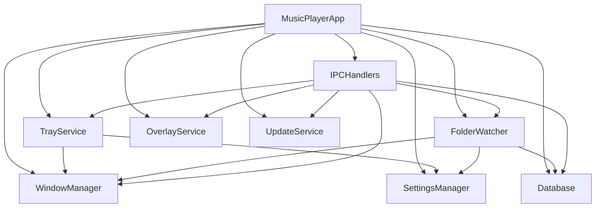

# Main Process Services

The main process uses a service-oriented architecture where each service handles specific functionality and can be injected as dependencies.

## Service Architecture

All services are instantiated in `MusicPlayerApp.js` and connected through dependency injection:

```javascript
this.windowManager = new WindowManager();
this.settingsManager = new SettingsManager();
this.trayService = new TrayService(this.mainWindow, this.settingsManager);
this.folderWatcher = new FolderWatcher(this.database, this.settingsManager, this.mainWindow);
// ... other services
```

## Core Services

### WindowManager (`src/main/services/WindowManager.js`)

Manages the creation and lifecycle of Electron BrowserWindow instances.

**Key Features:**
- Creates frameless window with custom title bar
- Enforces minimum window dimensions (800x600)
- Handles development mode DevTools
- Implements security best practices

**Configuration:**
```javascript
{
  width: 1200,
  height: 800,
  minWidth: 800,
  minHeight: 600,
  frame: false,                    // Custom title bar
  titleBarStyle: 'hidden',
  webPreferences: {
    nodeIntegration: false,        // Security: No Node.js in renderer
    contextIsolation: true,        // Security: Context isolation
    preload: path.join(__dirname, 'preload.js')
  }
}
```

**Methods:**
- `createWindow()` - Creates and configures main application window
- `getMainWindow()` - Returns reference to main window
- `closeWindow()` - Safely closes window and cleans up resources

### TrayService (`src/main/services/TrayService.js`)

Handles system tray integration and minimize-to-tray functionality.

**Key Features:**
- Creates system tray icon with custom music note graphic
- Context menu with show/hide/settings/quit options
- Double-click to toggle window visibility
- Configurable minimize-to-tray behavior

**Context Menu Options:**
- Show Music Player
- Hide Music Player
- Settings (opens settings modal in renderer)
- Quit (clean shutdown)

**Methods:**
- `createTray()` - Initializes system tray with icon and menu
- `updateMinimizeToTrayEnabled(enabled)` - Toggles tray functionality
- `showWindow()` / `hideWindow()` - Window visibility control
- `handleWindowClose(event)` - Intercepts close event for tray functionality
- `quit()` - Clean shutdown with tray cleanup

### SettingsManager (`src/main/services/SettingsManager.js`)

Manages user preferences and application configuration.

**Storage Location:** User data directory (`app.getPath('userData')/settings.json`)

**Key Settings:**
- `watchedFolders` - Array of monitored directory paths
- `minimizeToTray` - Boolean for tray behavior
- `crossfadeEnabled` - Audio crossfade setting
- `crossfadeDuration` - Crossfade duration in seconds
- `autoUpdate` - Automatic update checking
- `version` - Settings schema version

**Methods:**
- `loadSettings()` - Loads settings from disk with defaults
- `saveSettings(settings)` - Persists settings to disk
- `getDefaultSettings()` - Returns default configuration

### FolderWatcher (`src/main/services/FolderWatcher.js`)

Monitors directories for new audio files and automatically imports them.

**Technology:** Uses `chokidar` for cross-platform file system watching

**Key Features:**
- Recursive directory monitoring
- Supports multiple watched folders
- Batch import processing with progress updates
- Duplicate detection and handling
- Automatic metadata extraction

**Supported File Extensions:**
- `.mp3`, `.flac`, `.wav`, `.m4a`, `.aac`, `.ogg`

**Batch Processing:**
- Import queue prevents UI blocking
- Progress notifications to renderer process
- Statistics tracking (added/duplicates/errors)
- Graceful error handling for corrupted files

**Methods:**
- `addWatchedFolder(folderPath)` - Starts monitoring directory
- `removeWatchedFolder(folderPath)` - Stops monitoring and removes watcher
- `importFilesFromFolder(folderPath)` - Manual folder import
- `processImportQueue()` - Batch processes queued files
- `isAudioFile(filePath)` - Validates file extension

**Event Handling:**
```javascript
watcher.on('add', (filePath) => {
  if (this.isAudioFile(filePath)) {
    this.queueFileForImport(filePath);
  }
});
```

### OverlayService (`src/main/services/OverlayService.js`)

Provides custom notification overlays when the main window is minimized.

**Key Features:**
- Creates transparent overlay windows
- Custom notification styling
- Auto-dismiss timers
- Screen positioning logic

**Use Cases:**
- Song change notifications
- Import progress updates
- Error notifications
- System integration feedback

### UpdateService (`src/main/services/UpdateService.js`)

Handles automatic update checking and installation.

**Key Features:**
- Periodic update checks
- Update notification system
- Background download capability
- Restart-to-apply updates

**Configuration:**
- Check interval: Configurable (default: daily)
- Update server: Configured in build system
- Auto-install: User preference

## Service Dependencies



## Error Handling Patterns

### Service Initialization
Each service implements graceful error handling during initialization:

```javascript
try {
  this.trayService = new TrayService(this.mainWindow, this.settingsManager);
  console.log('TrayService initialized successfully');
} catch (error) {
  console.error('TrayService initialization failed:', error);
  // Continue without tray functionality
}
```

### Runtime Error Recovery
Services implement fallback mechanisms:

```javascript
// FolderWatcher: Skip corrupted files, continue processing
catch (error) {
  console.error(`Failed to import ${filePath}:`, error);
  this.batchStats.errors++;
  // Continue with next file
}
```

### Resource Cleanup
All services implement proper cleanup:

```javascript
// TrayService cleanup
destroyTray() {
  if (this.tray) {
    this.tray.destroy();
    this.tray = null;
  }
}
```

## Inter-Service Communication

Services communicate through:

1. **Direct method calls** for synchronous operations
2. **Event emission** for decoupled notifications
3. **IPC messages** for renderer communication
4. **Settings persistence** for state sharing

This architecture ensures modularity, testability, and maintainability while providing robust error handling and resource management.